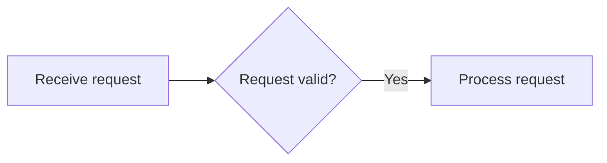
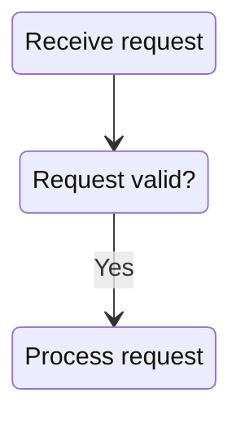

# High-Level Design: Excalidraw-to-Mermaid Converter

## 1. Executive Summary

It is technically plausible to convert a useful subset of Excalidraw diagrams into Mermaid with high reliability.

An Excalidraw file is plaintext JSON containing an array of canvas elements. These elements include identifiers, types, positions, dimensions, text, and relationship information. Excalidraw also supports text containers and arrows bound to shapes, providing much of the structural information required to reconstruct a graph.

The converter should not attempt pixel-perfect reproduction. Instead, it should extract:

- Nodes from boxes and other supported shapes.
- Node labels from associated text.
- Directed edges from arrows.
- Edge labels from arrow-associated text.
- Optional groups from frames and spatial containers.
- Approximate diagram direction from the original layout.

The default output should be a Mermaid `flowchart`, because flowcharts directly represent arbitrary nodes and edges and support several orientations.

An optional `stateDiagram-v2` output mode can represent boxes as states and arrows as transitions. Mermaid state diagrams support states, labelled transitions, start/end markers, composite states, choices, forks, and notes. However, arbitrary Excalidraw drawings do not necessarily carry those semantics, so state-diagram-specific constructs should only be inferred under strict rules.

## 2. Product Goal

Create a deterministic converter that accepts an `.excalidraw` file and produces:

1. Valid Mermaid source.
2. A conversion report.
3. A rendered preview.
4. Machine-readable verification results.
5. Warnings for every element or relationship that could not be represented confidently.

The initial product objective is:

> Reliably convert diagrams composed primarily of labelled boxes and arrows into structurally equivalent Mermaid diagrams.
> 

## 3. Scope

### 3.1 Initial supported input

The first production scope should support:

- Rectangle nodes.
- Ellipse nodes.
- Diamond nodes.
- Text inside or spatially associated with nodes.
- Directed arrows.
- Undirected lines, optionally converted to Mermaid links.
- Labels attached to arrows.
- Frames as optional Mermaid subgraphs.
- Excalidraw clipboard JSON as well as full `.excalidraw` files.

Excalidraw’s documented format contains `elements`, `appState`, and `files`, while its clipboard representation uses a similar structure.

### 3.2 Initial Mermaid targets

Two output modes should be supported.

#### Flowchart mode — default



Use this mode whenever the source is fundamentally a connected set of visual objects.

#### State diagram mode — optional



Use this only when the user explicitly requests a state diagram or when the converter detects strong state-machine conventions.

### 3.3 Explicit non-goals for the first release

The first release should not promise faithful conversion of:

- Freehand drawings.
- Images.
- Embedded files.
- Tables.
- Complex icons.
- Decorative lines.
- Arbitrary overlapping shapes.
- Hand-drawn UML notation.
- Exact coordinates or spacing.
- Exact fonts, colors, roughness, shadows, or stroke appearance.
- Multiple independent diagrams without clear separation.
- Semantic concepts that are not encoded in the file.

These elements should be reported rather than silently discarded.

## 4. Core Design Principle

The converter should transform:

```
Excalidraw scene
    ↓
Normalized visual objects
    ↓
Logical graph intermediate representation
    ↓
Mermaid source
    ↓
Parsed and rendered Mermaid
    ↓
Verification report
```

The intermediate graph is the central architectural boundary. Neither the Excalidraw parser nor the Mermaid emitter should directly depend on the other’s detailed representation.

## 5. Intermediate Representation

Define a format such as:

```tsx
interface DiagramGraph {
  id: string;
  direction: "TB" | "TD" | "BT" | "LR" | "RL";
  nodes: GraphNode[];
  edges: GraphEdge[];
  groups: GraphGroup[];
  warnings: ConversionWarning[];
}

interface GraphNode {
  id: string;
  sourceElementIds: string[];
  label: string;
  shape: "rectangle" | "ellipse" | "diamond" | "state";
  bounds: Bounds;
  parentGroupId?: string;
  confidence: number;
}

interface GraphEdge {
  id: string;
  sourceElementIds: string[];
  sourceNodeId?: string;
  targetNodeId?: string;
  label?: string;
  directed: boolean;
  confidence: number;
}

interface GraphGroup {
  id: string;
  label?: string;
  childNodeIds: string[];
  bounds: Bounds;
}

interface ConversionWarning {
  code: string;
  elementIds: string[];
  message: string;
  severity: "info" | "warning" | "error";
}
```

Every logical object retains its original Excalidraw element IDs. This enables debugging, explainability, regression testing, and visual highlighting of unresolved source objects.

## 6. Conversion Pipeline

### 6.1 Input validation

The reader should:

1. Parse JSON.
2. Verify the top-level document type.
3. Validate that `elements` is an array.
4. Ignore elements marked as deleted.
5. Reject dangerous or excessively large inputs.
6. Preserve unknown fields without depending on them.
7. Record the Excalidraw schema version and source.

Validation should be tolerant of additional fields because the format can evolve.

### 6.2 Element normalization

Normalize every relevant element into a simpler representation:

```tsx
interface NormalizedElement {
  id: string;
  type: string;
  bounds: Bounds;
  center: Point;
  rotation: number;
  text?: string;
  containerId?: string;
  frameId?: string;
  startBindingId?: string;
  endBindingId?: string;
  points?: Point[];
}
```

Coordinate transformations should account for:

- Relative arrow points.
- Negative widths or heights.
- Rotation.
- Group membership.
- Frame membership.
- Deleted elements.

### 6.3 Node extraction

Initially classify the following as node candidates:

- `rectangle`
- `ellipse`
- `diamond`

Optionally classify standalone text as a node when:

- It has connected arrows.
- It is explicitly enabled by configuration.
- It is not contained within another node.

Each node should receive a stable Mermaid-safe ID derived from its Excalidraw ID:

```
Excalidraw ID: W9m-1qA
Mermaid ID:    n_W9m_1qA
```

Labels must remain separate from IDs because Mermaid identifiers have stricter syntax than displayed text.

### 6.4 Node-label resolution

Resolve a node’s text using this priority:

1. Explicit text-to-container relationship.
2. Text whose `containerId` equals the node ID.
3. Text geometrically contained inside the node.
4. Text overlapping most of the node.
5. Nearest unassigned text within a conservative threshold.
6. Generated fallback label such as `Unnamed node 4`.

Excalidraw’s programmatic element API explicitly models labelled text containers and can calculate container dimensions from their labels, confirming that containers and labels are meaningful structural relationships rather than merely pixels.

When several text elements are associated with one node:

- Preserve reading order.
- Sort primarily by vertical position.
- Join adjacent lines with line breaks.
- Avoid combining distant text blocks automatically.
- Emit a warning when confidence is low.

### 6.5 Edge extraction

For every arrow or eligible line:

1. Resolve the source endpoint.
2. Resolve the target endpoint.
3. Determine whether the edge is directed.
4. Resolve an optional label.
5. Record confidence and evidence.

Endpoint resolution should use two levels.

#### Level 1: Explicit binding

Use Excalidraw binding metadata when present.

Excalidraw’s documented element creation API supports binding arrow starts and ends to specific shapes by ID.

This is the strongest evidence and should produce near-certain endpoint assignments.

#### Level 2: Geometric inference

For unbound arrows:

1. Calculate the absolute start and end points.
2. Find shapes containing each endpoint.
3. Otherwise find shapes within a configured snapping distance.
4. Score candidates using:
    - Endpoint distance to shape boundary.
    - Whether the arrow points toward the shape.
    - Whether the endpoint lies inside the shape.
    - Whether another shape obstructs the path.
    - Relative size and overlap.
5. Accept only when the best candidate exceeds a confidence threshold.
6. Leave the endpoint unresolved otherwise.

The converter must never connect an ambiguous arrow merely to avoid an error.

### 6.6 Edge-label resolution

Resolve an edge label using:

1. Explicit arrow-label relationship.
2. Text bound to the arrow.
3. Text nearest the arrow’s midpoint.
4. Text whose bounding box intersects the arrow path.
5. No label.

Text should only be consumed once unless the source relationship explicitly permits reuse.

### 6.7 Group and frame extraction

Frames may become Mermaid subgraphs:

```mermaid
subgraph authentication["Authentication"]
    login["Log in"]
    verify["Verify token"]
end
```

Mermaid flowcharts support subgraphs, while Excalidraw frames identify collections of child element IDs.

This should be deferred until basic node and edge extraction is stable.

### 6.8 Direction inference

Infer the Mermaid direction using the original node coordinates and edge vectors.

Suggested algorithm:

1. Calculate the median absolute horizontal edge displacement.
2. Calculate the median absolute vertical edge displacement.
3. Choose `LR` when horizontal displacement clearly dominates.
4. Choose `TB` when vertical displacement clearly dominates.
5. Use the user-configured default when neither dominates.
6. Permit a command-line override.

Direction inference should not try to preserve exact layout.

### 6.9 Mermaid generation

The emitter should:

- Escape reserved characters.
- Quote all user-provided labels.
- Produce deterministic ordering.
- Define nodes before edges.
- Avoid IDs derived directly from arbitrary text.
- Normalize line breaks.
- Limit unusually long labels.
- Preserve unsupported information in comments where useful.
- Include generator metadata outside the Mermaid block or as comments.

Mermaid flowcharts support labelled nodes, edges, multiple shapes, directions, and subgraphs. Mermaid also has syntax-sensitive terms and character combinations, so escaping and parser-based verification are mandatory.

## 7. Verification Architecture

Verification should happen after every conversion, not only during testing.

### 7.1 Syntax verification

Pass the generated source through the installed Mermaid parser.

A conversion is not successful unless Mermaid accepts the complete output.

### 7.2 Render verification

Render the accepted Mermaid source to SVG.

The Excalidraw project’s Mermaid integration similarly uses Mermaid rendering to SVG to obtain element position and dimensions, demonstrating that rendered SVG is a practical verification artifact.

Check that:

- SVG output exists.
- SVG dimensions are finite and non-zero.
- Expected text labels appear.
- No renderer exception occurs.
- The output stays below configured size limits.

### 7.3 Structural verification

Parse or instrument the generated Mermaid and compare it with the intermediate graph:
